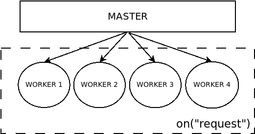

# How it works

When you run an Expressive application using Swoole, you will execute PHP from
the command line interface, **without using a web server**.

This sounds a bit strange in PHP, though it will be familiar to [Node.js](https://nodejs.org)
developers; the execution model under Swoole is similar to that technology.

The HTTP server of Swoole is a PHP class that offers callbacks on a number of events,
using the `on(string $name, callable $action)` method.

The request handler implemented in zend-expressive-swoole is a runner that
enables the execution of an Expressive application inside the `on('request')`
event of `Swoole\Http\Server`. This runner is implemented in the
`Zend\Expressive\Swoole\SwooleRequestHandlerRunner` class.

The basic implementation acts similar to the following:

```php
public function run() : void
{
    $this->swooleHttpServer->on('start', function ($server) {
        printf("Swoole is running at %s:%s\n", $server->host, $server->port);
    });

    $this->swooleHttpServer->on('request', function ($request, $response) {
        printf(
            "%s - %s - %s %s\n",
            date('Y-m-d H:i:sO', time()),
            $request->server['remote_addr'],
            $request->server['request_method'],
            $request->server['request_uri']
        );
        $emitter = new SwooleEmitter($response);
        try {
            $psr7Request = ($this->serverRequestFactory)($request);
        } catch (Throwable $e) {
            // Error in generating the request
            $this->emitMarshalServerRequestException($emitter, $e);
            return;
        }
        $emitter->emit($this->handler->handle($psr7Request));
    });

    $this->swooleHttpServer->start();
}
```

This package provides a bridge between `Swoole\Http\Request` (`$request`) and
[PSR-7](https://www.php-fig.org/psr/psr-7/) requests (`$psr7Request`;
specifically as implemented by [zend-diactoros](https://docs.zendframework.com/zend-diactoros))
via the class `Zend\Expressive\Swoole\ServerRequestSwooleFactory`.

It also provides a Swoole-specific emitter, `Zend\Expressive\Swoole\SwooleEmitter`,
that converts a PSR-7 response to a `Swoole\Http\Response` instance.

When you run an Expressive application using zend-expressive-swoole, you will
notice a bunch of PHP processes running. By default, Swoole executes 4 *worker*
(or *reactor*) processes and 1 *master* process, for a total of 5 PHP processes.



The advantages of this architecture are many: it's very light and simple (just
PHP processes running); it offers a service layer that is able to restart a
worker automatically if it's not responding; and it allows executing multiple
HTTP requests in parallel. The architecture is built for scaling.

## Performance

The ZF developers performed a benchmark running the default [zend-expressive-skeleton](https://github.com/zendframework/zend-expressive-skeleton)
application with Swoole 4.0.1, nginx 1.12.1, and Apache 2.4.27 (with mod_php)
using PHP 7.2.7.

The results demonstrated that **Expressive with Swoole runs 4 to 5 times faster
than nginx or Apache**.

This impressive result is primarily due to the shared memory approach of Swoole.
Unlike traditional apache/php-fpm usage, the memory allocated in Swoole will not
be freed after a request. This allows application configuration and artifacts
(such as middleware and handlers) to persist between requests and processes.

Under Swoole 4.1+, for even better performance, you can enable the option
`zend-expressive-swoole.enable_coroutine`. When this
is enabled, Swoole will run most I/O processes in coroutines. Doing so provides
approximately **10 times faster performance** than without coroutines, meaning a
Swoole-based application can be 40 to 50 times faster than running under nginx
or Apache. Performance improves with the number of workers (which are restricted
by the amount of memory); as such, performance can increase from these numbers.
